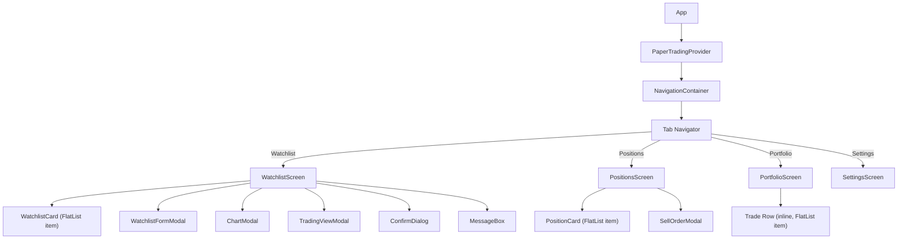
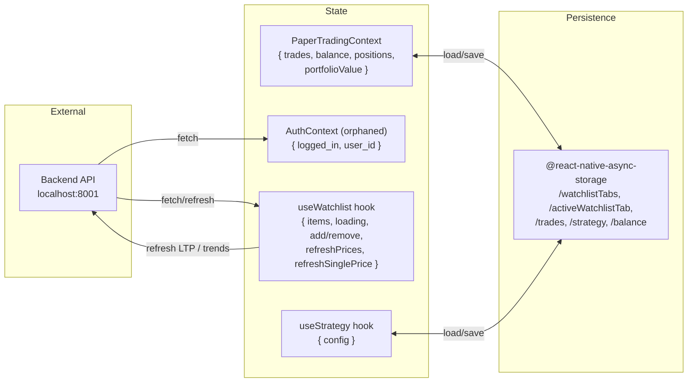

# Code Review Graph — Paper Trading App

## 1. Module Dependency Graph

```mermaid
graph TD
  subgraph Entry
    index["index.ts"] --> App["App.tsx"]
    index --> devWarnings["src/setup/devWarnings.ts"]
  end

  subgraph Screens
    App --> WS["WatchlistScreen"]
    App --> ScS["ScannerScreen"]
    App --> PS["PositionsScreen"]
    App --> PF["PortfolioScreen"]
    App --> SS["SettingsScreen"]
    LS["LoginScreen (orphaned)"]
  end

  subgraph Context
    App --> PTC["PaperTradingContext"]
    LS --> AC["AuthContext (orphaned)"]
    WS --> PTC
    PS --> PTC
    PF --> PTC
  end

  subgraph Hooks
    WS --> useW["useWatchlist"]
    WS --> useS["useStrategy"]
  end

  subgraph Components
    WS --> ChartModal
    WS --> WatchlistCard
    WS --> WatchlistFormModal
    WS --> TradingViewModal["TradingViewModal (WebView)"]
    WS --> ConfirmDialog
    WS --> MessageBox
    ScS --> ChartModal
    ScS --> TradingViewModal
    PS --> PositionCard
    PS --> SellOrderModal
    LS --> MessageBox
  end

  subgraph Utils
    PTC --> storage
    PTC --> positions
    useW --> api
    useS --> storage
    SS --> storage
    SS --> api
    WS --> api
    TradingViewModal --> tradingView
    WatchlistFormModal --> symbolCatalog
    symbolCatalog --> NFO_csv["NFO_symbols.txt.csv / NFO_symbols.csv"]
    symbolCatalog --> NSE_csv["NSE_symbols.txt.csv / NSE_symbols.csv"]
    AC --> api
  end

  subgraph Types
    types["types/index.ts"]
    storage --> types
    positions --> types
    ChartModal --> types
    WatchlistCard --> types
    WatchlistFormModal --> types
    TradingViewModal --> types
    PositionCard --> types
    SellOrderModal --> types
    useW --> types
    useS --> types
    tradingView --> types
  end

  subgraph Theme
    colors["theme/colors.ts"]
    ChartModal --> colors
    WatchlistCard --> colors
    WatchlistFormModal --> colors
    TradingViewModal --> colors
    ConfirmDialog --> colors
    MessageBox --> colors
    PositionCard --> colors
    SellOrderModal --> colors
    WS --> colors
    PS --> colors
    PF --> colors
    SS --> colors
    LS --> colors
  end

  style LS fill:#faa,stroke:#f00,stroke-dasharray:5
  style AC fill:#faa,stroke:#f00,stroke-dasharray:5
  style PriceChart fill:#faa,stroke:#f00,stroke-dasharray:5
```

## 2. Component Tree

## 3. Data Flow

## 4. File Responsibility Map

| Layer | File | Role |
| :--- | :--- | :--- |
| **Entry** | `index.ts` | Registers root component. |
| **Root** | `App.tsx` | Navigation shell, 4 bottom tabs, dark theme wrapper. |
| **Screens** | `WatchlistScreen.tsx` | Watchlist CRUD + horizontal tabs (scrollable custom watchlists) + local query search filtering + buy/sell + TradingView integrations. |
| | `ScannerScreen.tsx` | Bullish and bearish scrip ranks, sorting watchlist items by signal counts with detail grids and trade overrides. |
| | `PositionsScreen.tsx` | List open positions, sell order sheet flow. |
| | `PortfolioScreen.tsx` | Portfolio balance summary + historical trade logs. |
| | `SettingsScreen.tsx` | Configure connection API base URL and custom CSV symbol catalog file paths. |
| | `LoginScreen.tsx` | **Orphaned** — authentication interface, not integrated into app navigation. |
| **Context** | `PaperTradingContext.tsx` | Global paper trades, balance, positions state. |
| | `AuthContext.tsx` | **Orphaned** — authentication provider, not initialized in `App.tsx`. |
| **Hooks** | `useWatchlist.ts` | Watchlist API requests + parse option symbols. |
| | `useStrategy.ts` | EMA strategy configuration stored in AsyncStorage. |
| **Shared UI** | `WatchlistCard.tsx` | Watchlist row with signals and single LTP refresh actions. |
| | `WatchlistFormModal.tsx` | Symbol lookup modal supporting direct queries and option strike matching. |
| | `ChartModal.tsx` | Buy/sell trading bottom sheet. |
| | `TradingViewModal.tsx` | Renders TradingView widget within a WebView (or opens target browser tab on web platform). |
| | `PositionCard.tsx` | Active position summary card. |
| | `SellOrderModal.tsx` | Sell order execution bottom sheet. |
| | `ConfirmDialog.tsx` | Confirmation dialog window. |
| | `MessageBox.tsx` | Contextual notifications / error toasts. |
| | `PriceChart.tsx` | **Orphaned** — SVG line graph, not referenced by active screens. |
| **Utils** | `api.ts` | REST API connection handler. |
| | `storage.ts` | AsyncStorage helper functions for trades, balance, and settings configuration. |
| | `positions.ts` | Ledger parsing functions: `computePositions`, `getHeldQuantity`. |
| | `tradingView.ts` | Option and stock symbol TradingView URL builder. |
| | `symbolCatalog.ts` | CSV catalog file parser for NSE and NFO assets. |
| **Foundation** | `types/index.ts` | Type declarations and interfaces. |
| | `theme/colors.ts` | Global color palette constants and borders. |
| | `setup/devWarnings.ts` | LogBox warning filter configs. |

## 5. Issues Found

| # | Severity | Issue | File |
|---|---|---|---|
| 1 | **High** | **`LoginScreen` and `AuthContext` are orphaned** — Defined but never mounted in `App.tsx`. User login cannot be performed on the frontend. | `LoginScreen.tsx`, `AuthContext.tsx` |
| 2 | **High** | **`PriceChart` is orphaned** — Defined and exported, but dead code as it is never imported. | `PriceChart.tsx` |
| 3 | **High** | **Hardcoded Paper Trade execution and position pricing** — `executeTrade` assigns `const price = 0` and `computePositions` uses `const currentPrice = 0`. Frontend balance and P&L displays are mock values with no active market feed computation. | `PaperTradingContext.tsx:91`, `positions.ts:31` |
| 4 | **Medium** | **Lack of linting and formatting frameworks** — The frontend lacks Prettier, ESLint, or auto-formatting configurations, which can lead to layout discrepancies. | (entire project) |
| 5 | **Medium** | **No frontend test suites** — Missing testing dependencies, config profiles, and Jest test cases. | (entire project) |
| 6 | **Medium** | **Unimplemented Token Expired Callback** — `setTokenExpiredHandler` registers in `WatchlistScreen` but is dead code since there's no auth navigation setup. | `WatchlistScreen.tsx` |
| 7 | **Low** | **Redundant package-lock exclusion in git** — `.gitignore` attempts to ignore `package-lock.json` but it's already committed/tracked, making the rule ineffective. | `.gitignore` |

## 6. Key Architectural Notes

- **Separated watchlists vs trades**: Watchlist symbols reside in the backend SQLite DB, whereas paper trading balance, strategy setups, and trade logs are stored locally in React Native `AsyncStorage`.
- **Custom tabs persistence**: Watchlist tab names and active tab selection are persisted in `AsyncStorage` and passed to the backend API to filter database query returns.
- **Offline CSV symbol catalog loading**: NSE and NFO catalogs contain local CSV copies bundled using `expo-asset` which are read directly at startup. Local custom overrides can be configured via Settings.
- **WebView Charting**: Live price charting is simulated by passing option contract specs through `tradingView.ts` and rendering the URL in a `WebView` container.
