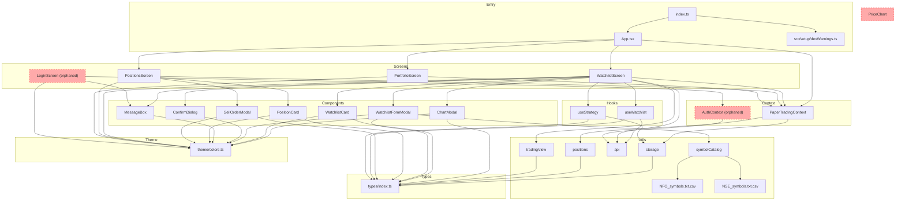
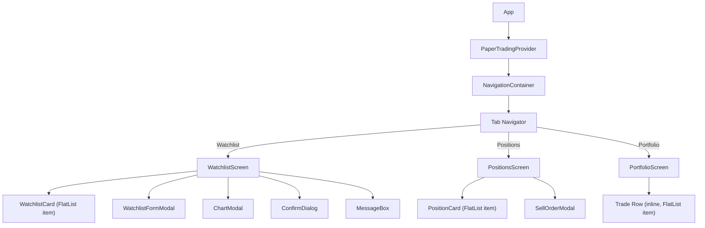
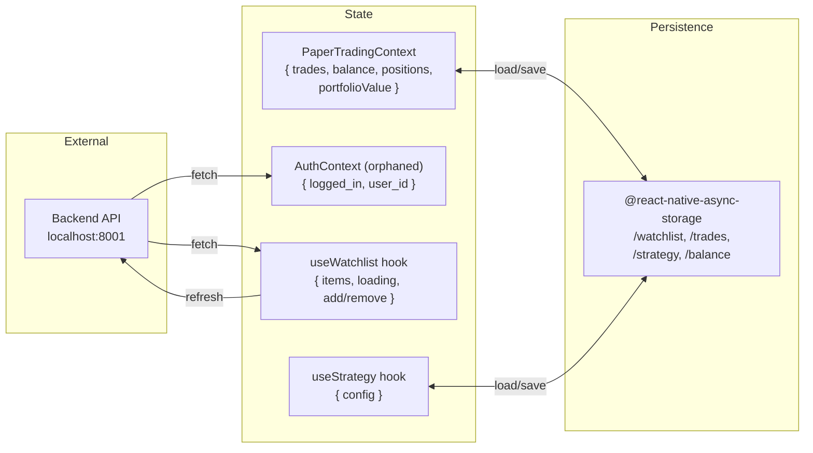

# Code Review Graph — Paper Trading App

## 1. Module Dependency Graph

## 2. Component Tree

## 3. Data Flow

## 4. File Responsibility Map

| Layer | File | Role |
|-------|------|------|
| **Entry** | `index.ts` | Registers root component |
| **Root** | `App.tsx` | Navigation shell, 3 tabs, dark theme |
| **Screens** | `WatchlistScreen.tsx` | Watchlist CRUD + buy/sell + TradingView |
| | `PositionsScreen.tsx` | List open positions, sell flow |
| | `PortfolioScreen.tsx` | Portfolio summary + trade history |
| | `LoginScreen.tsx` | **Orphaned** — not wired into navigation |
| **Context** | `PaperTradingContext.tsx` | Global trades, balance, positions state |
| | `AuthContext.tsx` | **Orphaned** — providers not used in App |
| **Hooks** | `useWatchlist.ts` | Watchlist API CRUD + option symbol parsing |
| | `useStrategy.ts` | EMA strategy config from AsyncStorage |
| **Shared UI** | `WatchlistCard.tsx` | Watchlist row with signal badge |
| | `WatchlistFormModal.tsx` | Symbol search modal (NSE + NFO) |
| | `ChartModal.tsx` | Buy/sell bottom sheet |
| | `PositionCard.tsx` | Position summary card |
| | `SellOrderModal.tsx` | Sell order bottom sheet |
| | `ConfirmDialog.tsx` | Generic confirmation dialog |
| | `MessageBox.tsx` | Alert/toast components |
| | `PriceChart.tsx` | **Orphaned** — SVG chart, not used anywhere |
| **Utils** | `api.ts` | HTTP client (localhost:8001) |
| | `storage.ts` | AsyncStorage read/write helpers |
| | `positions.ts` | `computePositions`, `getHeldQuantity` |
| | `tradingView.ts` | TradingView URL builder |
| | `symbolCatalog.ts` | NSE/NFO CSV symbol loader + search |
| **Foundation** | `types/index.ts` | All interfaces (PaperTrade, Position, etc.) |
| | `theme/colors.ts` | Dark theme palette, spacing, radius |
| | `setup/devWarnings.ts` | LogBox suppression |

## 5. Issues Found

| # | Severity | Issue | File |
|---|----------|-------|------|
| 1 | High | **`LoginScreen` and `AuthContext` are orphaned** — defined but never used in `App.tsx`. No auth flow is active. | `LoginScreen.tsx`, `AuthContext.tsx` |
| 2 | High | **`PriceChart` is orphaned** — defined and exported, but no screen imports it. Chart data types exist but are dead code. | `PriceChart.tsx` |
| 3 | High | **All prices hardcoded to `0`** — `executeTrade` uses `const price = 0`, and `computePositions` uses `const currentPrice = 0`. All monetary displays are decorative. | `PaperTradingContext.tsx:91`, `positions.ts:31` |
| 4 | Medium | **No linting/formatting** — zero ESLint, Prettier, Husky, or CI configuration. Only TypeScript strict mode is enabled. | (entire project) |
| 5 | Medium | **No testing** — no Jest, no test files, no testing dependencies. | (entire project) |
| 6 | Medium | **Unused `onTokenExpired` handler gap** — `setTokenExpiredHandler` is called in `WatchlistScreen` but `LoginScreen`/`AuthContext` are not wired to re-authenticate. | `WatchlistScreen.tsx:75` |
| 7 | Low | **`package-lock.json` is gitignored** — `.gitignore` lists it but it's already tracked, so the rule is ineffective. | `.gitignore` |

## 6. Key Architectural Notes

- **State flows one way**: `PaperTradingContext` → Screens → Components. No child-to-parent back-propagation.
- **Two persistence backends**: watchlist data lives on the remote API; trades/balance/strategy live in AsyncStorage.
- **No live price feed**: Price is `0` everywhere. The app is a UI skeleton without market data integration.
- **CSV files are bundled**: `NFO_symbols.txt.csv` and `NSE_symbols.txt.csv` (~100KB+) are loaded via `expo-asset` at runtime.
